\pagenumbering{roman}     <!-- first page with Roman numbering -->

\newpage                  <!-- new page -->

\begin{center}          % <!-- center text -->

\LARGE{Cyclist Road Accidents in UK using Machine Learning and Visualization techniques.} % <!-- make large text -->

\bigskip                % <!-- blank lines -->
\bigskip

```{r, include=TRUE, echo=FALSE, message=FALSE, warning=FALSE, fig.pos="h!", fig.align="center"}
  knitr::include_graphics("university logo.jpg")
```

\large{A thesis presented for the degree of }

\large{MSc. Data Science and Analytics} 

------------------------------------------------

\large{Submitted by}


\LARGE{Suraj Sankar Mandal}

\LARGE(19251248)

\bigskip
\bigskip

\large{under the guidance of the supervisor}


\LARGE{Dr. Catherine Hurley}

\bigskip
\bigskip
\bigskip
\bigskip

\large{Department of Mathematics and Statistics}

\large{Maynooth University}

\large{August 2020}


\end{center}              <!-- end center -->

\newpage 

\begin{center}

\LARGE{STATEMENT OF ORIGINALITY}
 

\end{center}

\bigskip
I have read and accepted the Departmental policies on plagiarism and acknowledge that the work presented in this study entitled Cyclist Road Accidents in the United Kingdom using Machine Learning and Visualization Technology is my own and has not been applied in any way to any degree or qualification at any university or other tertiary institution. In addition, I have referenced correctly all literature and sources used in this work.
 

**Signed by: ** Suraj Mandal

**Date: ** 13/08/2020

\newpage 

\begin{center}

\LARGE{ACKNOWLEDGEMENT}
 

\end{center}

I would like to convey my heartfelt gratitude to my supervisor, **Dr. Catherine Hurley**, for her tremendous encouragement and dedication to supporting me through the entire process. Her guidance, assistance and inspiration encouraged me to finish the project. I am thankful to my supervisor for arranging weekly team sessions, discussing my concerns and recommending opportunities to strengthen the research process.

\newpage 

\begin{center}

\large{Abstract}


\end{center}

\bigskip
Road Traffic Accidents (RTAs) are a major problem in today's world, as their number continues to grow every year due to an increase in the use of road transport and a variety of other factors. All datasets were imported from traffic incidents, taken from the UK dataset STATS19 for the year 2018. The knowledge derived from these large datasets forms the basis for a variety of predictions. Some data mining methods, such as the handling of an imbalanced dataset, Naive Bayes, Logistic Regression, Random Forest and Decision Tree, are used for prediction purposes. This paper describes the best algorithm model to be used to improve the accuracy and predictability of cyclist accidents. The project will define the most suitable classification algorithm that can be used to predict cyclist casualties in the future. In addition, the key factors causing these road accidents are identified and presented.

**Keywords— ** Road Accident, Naive Bayes, Logistic Regression, Random Forest, Decision Tree.


\newpage 

\tableofcontents

\newpage
# List of tables{-}
\renewcommand{\listtablename}{}
\listoftables

\newpage
# List of figures{-}
\renewcommand{\listfigurename}{}
\listoffigures

\newpage

\pagenumbering{arabic} 

# Introduction{#intro}
## Purpose and Motivation
Road Traffic Accidents (RTAs) are one of the primary causes of death in today's world, ranking as the 10th leading cause of death worldwide. Road safety is a critical issue for many countries, where traffic deaths and injuries are increasingly recognized as a significant public health problem. According to the World Health Organization (WHO), nearly 1.25 million people die per year in traffic accidents, with an average of 3,287 deaths each day. In comparison, traffic fatalities rate as the 9th leading cause of death and account for 2.2% of all deaths worldwide. By analyzing these factors and making effective predictions using data mining techniques, proper precautions can be taken to minimize the severity of these cyclist casualties. In the United Kingdom, the number of miles cycled per person seems to have increased from 37 to 53 miles in recent years (DfT, 2013). In the United Kingdom, the risk of death from traveling one kilometer on foot or by bicycle is more than 17 times higher than that of a car (Davies, 2014). The geographical and demographic distribution of factors linked to the uptake of bicycles has powerful policy implications, but has received little academic attention (Fraser & Lock, 2011). 
As a big data project, I wanted to use machine learning to explore the factors affecting cyclist accidents in more detail.

## About the dataset
The following three datasets were used for research purposes and were collected from the UK dataset STATS19 (2018) in R(@stats) which is available at data.gov.uk (@ukgov). The data are collected by the police at the roadside, the variables and fields collected are defined by the Department for Transport (DfT) and these have been agreed by the Standing Committee for Road Accident Statistics (SCRAS) and Association of Chief Police Officers (ACPO).
The three datasets 'Accidents,' 'Casualties' and 'Vehicles' were merged together into a single dataset used for the analysis and modeling of data in this study. The merged data set consists of 160,597 observations and 68 variables. The dataset provides information on the geographical area of the accident, road conditions, light conditions, weather conditions, severity of the accident, casualties and vehicle make and type. The target variable for the prediction is the 'Casualty Severity', which is a factor variable that contains three levels such as 'fatal', 'serious', and 'slight' for 'Casualty Type' - cyclist. The remaining 67 independent variables will provide information on the target variable predictions.

## Aims and Objectives
The aims and objectives of this project are as follows:

* **Objective A:** Identify the main factors that have a significant effect on cyclist accidents in United Kingdom. 

* **Objective B:** To implement and evaluate the following classification models and to evaluate their results in order to identify the most efficient algorithm.
    * Naive Bayes
    * Logistic Regression
    * Random Forest
    * Decision Tree

* **Objective C:** To demonstrate ways of handling an imbalanced data.

* **Objective D:** Identifying the important attributes of the data using Random Forest technique and feeding the important ones as input to other classification techniques to identify if it yields better results than the existing models.

## Outline of the Thesis
This thesis has been structured into five chapters and each chapter has multiple subsections.

*Chapter 1: Introduction*

Provides an introduction to the research topic with aim and objectives of the project and provides an overview to different chapters in the thesis.

*Chapter 2: Background*

Highlights the similar work performed in literature.

*Chapter 3: Methodology*

This chapter explains the detailed methodology implemented in the analysis of datasets.

*Chapter 4: Results* 

Demonstrates the results obtained after analysis of dataset.

*Chapter 5: Conclusion and Future Scope* 

Concludes the results obtained from this project and discusses the future scope of this project.

\newpage
# Background{}

## Literature Review

The main focus of earlier studies identified various attributes, such as road segments, intersections, road surfaces and weather, which have a significant impact on crashes. This has led to a number of improvements in road safety measures. Despite the attributes mentioned above, it can not be the main contributor to the crash. Few researchers have studied the properties of macro-levels such as cross junction, traffic zones, census. There are a significant number of unobserved explanatory variables in road crash analyzes that influence the frequency and severity of accidents. Identifying the hidden pattern is quite a challenge. The reason for most of the accident data is highly imbalanced, which makes the analysis quite challenging. 
Traditionally, road accident hotspot analysis has focused on road segments or specific junctions, while area-wide hotspots and the spread of risk resulting from a collision are somewhat neglected. The methodological downside was that Poisson log linear regression was used to compensate for the randomness of time and space incidents (@blower). In a joint (@harb) analysis, the causality of the accident was investigated using the Random forest and the decision tree. This helped to classify the location of the vehicles, and the driver characteristics of the accident avoidance maneuvers result were more reliable compared to the genetic algorithm. A two-stage mixed multivariate model to estimate the occurrence of incidents at their severity rates, which helped classify the low-frequency accident. (@Sowmya) predicted the causality severity of the accident using Naive Bayes model technique. The accuracy of the the model was comparatively high than other models. The author (@brennan) studied the data imbalance class using various tools and methods to produce accurate results. Data imbalance is a major issue in the approach to data mining, the author has provided a very extensive approach to dealing with class imbalances using boosting and other techniques.


\newpage
# Methodology{}

## CRISP-DM methodology
Cross-industry Standard Process for Data Mining (CRISP-DM) is being used in the project. Based on the polls of the KDNuggets, CRISP-DM is one of the common methodologies that comes with six different phases. The phases are business understanding, data understanding, data preparation, modeling, evaluation and deployment. The following (figure 1) shows the CRISP-DM Methodology.

```{r, include=TRUE, echo=FALSE, message=FALSE, warning=FALSE, fig.pos="h!", fig.align="center",fig.cap="CRISP-DM Methodology"}
  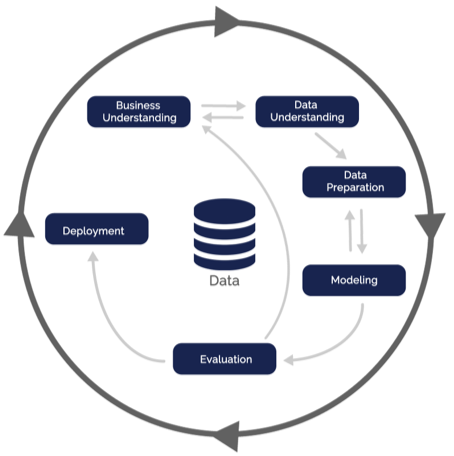
```

* **Phase-1 Business Understanding:** The first step involves doing a critical review on cyclist accidents which occurred in United Kingdom. The objective is to support authorities in the improving the road networks.

* **Phase-2 Data Understanding:** The data needed to conduct the cyclist road accident analysis in the United Kingdom were collected from the UK dataset STATS19 (2018)(@stats). The repository consists of three files relating to accidents, casualties and vehicles in the .csv format, which are combined together into one for data analysis. The extracted data was evaluated to ensure that it met the business requirements with the aid of a data description guide. The merged dataset comprises of 160,597 observations and 68 variables including the target variable, 'Casualty Severity'. Some of the attributes are as follows.

    * *Police_Force* : Types of police forces in United Kingdom which consists of 51 classes for counties.

    * *Casualty_Severity* : Severity of the accidents occurred for the casualty type cyclist. This is the target variable for this study. It consists of three classes such as slight, serious and fatal.

    * *Date* : It shows the date on which the accident occurred.

    * *Day_of_Week* : The occurrence of an accident on a particular day of the week.

    * *Time* : Accidental occurrence at various times.

    * *Local_Authority_District* : The authority concerned for the particular district in which the accident occurred. Variable has 416 classes comprising all regions of the United Kingdom.

    * *Road_Type* : Denotes the type of road. It has 8 classes.

    * *Speed_limit* : It denotes the speed limit set for the roads where the casualties happened.

    * *Junction_Detail* : This provides details on the respective junctions at which accidents occurred. It contains 10 classes.

    * *Light_Conditions* : This denotes the light conditions at the event of accidents. It contains 6 classes.

    * *Weather_Conditions* : It denotes the weather conditions during which the accidents occurred. It contains 10 classes.

    * *Road_Surface_Conditions* : It denotes the surface conditions of the roads in which accidents have occurred. It contains 7 classes.

    * *Urban_or_Rural_Area* : It indicates whether the accident occurred in urban or rural areas. It contains 3 classes.

    * *Age_of_Casualty* : This indicates the age of the casualties at the time of the accident.

    * *Sex_of_Casualty* : It denotes the gender of the casualty.

    * *Journey_Purpose_of_Driver* : It denotes the journey purpose of the driver. It consists of 6 classes.
    
    * *Special_Conditions_at_Site* : It denotes if there were any special conditions at the site. It contains 9 classes.
    
    * *Junction_Control* :  It contains information about the respective individual who is in charge of the respective junction in which accidents occurred. It contains 6 classes.

* **Phase-3 Data Preparation:** It consists of integration and cleaning of data. For this project, the three .csv files are merged together using the RStudio merge feature.

* **Phase-4 Data Modeling:** This step consists of implementing method that uses various data mining algorithms, i.e. naive bayes, logistic regression, random forest and decision tree algorithms to implement the predictive models and the ROSE package is used to manage the imbalanced data collection.

* **Phase-5 Data Evaluation:** This step consists of data evaluation of the results for the predictive models. In this project metrics such as confusion matrix and accuracy are used to determine the best-fit algorithm.

* **Phase-6 Data Deployment:** This is the final step of the CRISP-DM Methodology, RStudio was used to deploy an algorithm that provides the highest accuracy for constructing the model and predicting the extent of cyclist accidents in the United Kingdom.


## Data Preparation
The data needed to conduct the cyclist accident analysis in the United Kingdom were collected from the UK dataset STATS19 (2018) (@stats). Initial data collection includes gathering datasets, as the repository consists of three files 'accident.csv', 'vehicle.csv' and 'casualty.csv' for the year 2018. Every of these reports includes the necessary information on road collisions, their victims and the vehicles involved. These three files are loaded into the RStudio and merged into a single csv file based on their respective 'accident index' using the R programming 'merge' function. To look for the cyclist casualty the author have filter the dataset using the filter function from tidyverse package in R (@tidyverse) where the Casualty Type is 'Cyclist'. As a result, the data set for the analysis of this study is produced.

```{r, include=TRUE, echo=FALSE, message=FALSE, warning=FALSE, fig.pos="h!", fig.align="center",out.height="16%",fig.cap="Snapshot of the merged dataset"}
  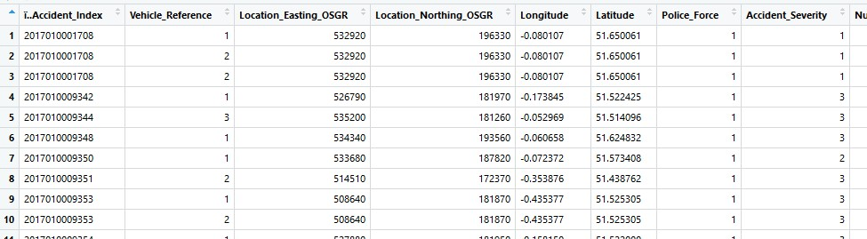
```

(Figure 2) provides a snapshot of the combined dataset for our study, consisting of a total of 68 variables and 17550 observations.

### Treating the missing values
It is important to treat the missing values in the dataset as they affect the accuracy of the prediction during modeling and provide incorrect results. There are about 32 missing values in this dataset. Upon further study, it was noted that several instances had a value of '-1' which was also considered missing as per the data guide obtained. As a result, instances containing the value '-1' were replaced by 'NA' using the 'lapply' (@matrix) function (figure 3) so that they could be viewed as missing values. This resulted in a few instances of missing values in the results. Omit function in R (@omit) was used to remove all the missing values and the dataset with no missing values was thus obtained for further analysis.

```{r, include=TRUE, echo=FALSE, message=FALSE, warning=FALSE, fig.pos="h!", fig.align="center",out.width="75%",fig.cap="Replacing the '-1' with 'NA'"}
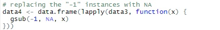
```

### Selecting the desired variables
Using too many variables on the dataset while modeling makes the process difficult and reduces the performance of the predictions due to the effect of irrelevant attributes. The dataset includes 68 attributes, most of which are not applicable to the subject area of this report, such as vehicle registration number, propulsion code, engine_capacity_cc, location easting of OSGR, engine_capacity_cc, location northing of OSGR, was_vehicle_left_hand_drive etc. Thus, the irrelevant attributes have been deleted and refined to include only the following 16 main variables (Table 1) that affect the target variable 'Casualty Severity' for cyclist.

\begin{table}[!htb]
\caption{Selected attributes from the whole dataset}
\bigskip
\centering
\begin{tabular}{c l}
\hline\hline
Serial no. & Names of Attribute\\ [0.75ex]
\hline
1 & Date  \\
2 & Day\_of\_Week \\
3 & Time \\
4 & Road\_Type \\
5 & Speed\_limit  \\
6 & Junction\_Detail \\
7 & Junction\_Control \\
8 & Light\_Conditions \\
9 & Weather\_Conditions  \\
10 & Road\_Surface\_Conditions \\
11 & Special\_Conditions\_at\_Site \\
12 & Urban\_or\_Rural\_Area \\ 
13 & Sex\_of\_Casualty  \\
14 & Age\_of\_Casualty \\
15 & Casualty\_Severity \\
16 & Journey\_Purpose\_of\_Driver \\ [1ex]
\hline
\end{tabular}
\label{tab:Table 1}
\end{table}

\newpage
### Treating the class variables 
In the current dataset, the class of several variables was incorrect and was given by default as character as shown in (Table 2).

\begin{table}[h]
\caption{Structure of the dataset displaying the class of each variable}
\bigskip
\centering
\begin{tabular}{l l}
\hline\hline
Names of Attribute & Class of variables\\ [0.75ex]
\hline
Date & chr  \\
Day\_of\_Week & chr \\
Time & chr \\
Road\_Type & chr \\
Speed\_limit & chr  \\
Junction\_Detail & chr \\
Junction\_Control & chr \\
Light\_Conditions  & chr\\
Weather\_Conditions   & chr\\
Road\_Surface\_Conditions  & chr\\
Special\_Conditions\_at\_Site  & chr\\
Urban\_or\_Rural\_Area  & chr\\ 
Sex\_of\_Casualty   & chr\\
Age\_of\_Casualty  & chr\\
Casualty\_Severity  & chr\\
Journey\_Purpose\_of\_Driver & chr \\ [1ex]
\hline
\end{tabular}
\label{tab:Table 2}
\end{table}


As shown in Table 2, all the variables such as age of casualty, date and time variable, day of week, etc. are incorrectly classified as characters which is incorrect. Identifying the right class of each variable and converting it to the required class was then carried out.

\begin{table}[h]
\caption{Structure of the dataset showing the appropriate class and the levels for variables}
\bigskip
\centering
\begin{tabular}{l l}
\hline\hline
Names of Attribute & Class of variables\\ [0.75ex]
\hline
Date &  Factor w/ 12 levels  \\
Day\_of\_Week & Factor w/ 7 levels \\
Time & Factor w/ 4 levels \\
Road\_Type & Factor w/ 6 levels \\
Speed\_limit & Factor w/ 6 levels  \\
Junction\_Detail & Factor w/ 8 levels \\
Junction\_Control & Factor w/ 4 levels \\
Light\_Conditions  & Factor w/ 3 levels\\
Weather\_Conditions   & Factor w/ 8 levels\\
Road\_Surface\_Conditions  & Factor w/ 5 levels\\
Special\_Conditions\_at\_Site  & Factor w/ 8 levels\\
Urban\_or\_Rural\_Area  & Factor w/ 3 levels\\ 
Sex\_of\_Casualty   & Factor w/ 2 levels\\
Age\_of\_Casualty  & int\\
Casualty\_Severity  & Factor w/ 3 levels\\
Journey\_Purpose\_of\_Driver & Factor w/ 3 levels \\ [1ex]
\hline
\end{tabular}
\label{tab:Table 3}
\end{table}

\bigskip
\newpage
Table 3 demonstrates that all variables are organized into the dataset with the correct classes and levels.

### Binning the factor variables

Binning the levels in a factor variable involves in combining several levels into one for better data analysis and increasing the uniqueness of each level. The following levels of the variables are binned accordingly for an effective analysis.

```{r, include=TRUE, echo=FALSE, message=FALSE, warning=FALSE, fig.pos="h!", fig.align="center",out.width="75%",fig.cap="Distribution of the target variable"}
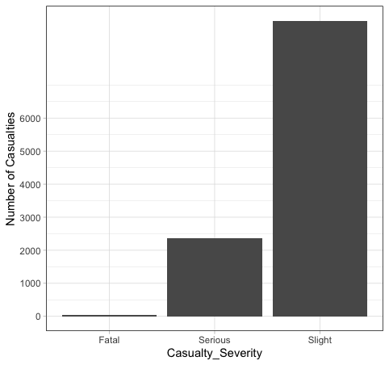
```

  * The target variable, 'Casualty Severity' consists of 3 levels: 'Fatal', 'Serious', 'Slight'. However, the data is imbalanced as shown in (figure 4), as a result, the target variable is biased towards the class 'Slight' with 80% of data. Hence, the two levels 'Fatal' and 'Serious' are combined into one level as 'High', while the other majority class as 'Low'.

  * The 'time' variable consists of time-stamps of the accident occurrence. In order to make this more meaningful and useful, the variable is converted into a factor variable containing 4 levels: 'Morning (5-12)', 'Afternoon (12-17)', 'Evening (17-20)', and 'Night (20-5)'.

  * The 'light conditions' with 5 levels were shrunk to 3 levels: 'Lit', 'Dark', 'Unknown'.

  * The 'weather conditions' with 9 levels were reduced to 8 levels: 'Fine – no high winds', 'Rain – no high winds', 'Snow – no high winds', 'Fine – high winds', 'Rain – high winds', 'Snow – high winds', 'Fog/Mist', 'Other'.

  * The variable, 'Journey purpose of driver' with 7 levels were reduced to 3 levels: 'For work', 'For school', 'Other'.

  * The variable, 'Road surface conditions' was categorized into 7 levels: 'Dry', 'Wet/Damp', 'Snow', 'Frost/Ice', 'Flood (3cm. deep)', 'Oil/Diesel', 'Mud'.

  * The variable, 'Day of the week' was simply classified into 'Monday', 'Tuesday', 'Wednesday', 'Thursday', 'Friday', 'Saturday', and 'Sunday'.

  * The variable, 'Road type' was classified into 'Roundabout', 'One way street', 'Dual carriageway', 'Single carriageway', 'Slip road', 'Unknown'.

With the implementation of all the above-mentioned changes, the refined dataset's structure is as follows (Table 4).

\begin{table}[h]
\caption{Structure of the refined dataset after binning the levels of factor variables}
\bigskip
\centering
\begin{tabular}{l l l}
\hline\hline
Names of Attribute & Class of variables & Levels\\ [0.75ex]
\hline
Date & Date  & format: '01/01/2018',..\\
Day\_of\_Week & Factor w/ 7 levels & 'Sunday','Monday',...\\
Time & Factor w/ 4 levels & 'Night','Morning',...\\
Road\_Type & Factor w/ 6 levels & 'Roundabout', 'One way street',...\\
Speed\_limit & Factor w/ 6 levels  & '20','30','40',...\\
Junction\_Detail & Factor w/ 8 levels & 'Roundabout','Mini-roundabout'\\
Junction\_Control & Factor w/ 4 levels & 'Authorised person','Auto traffic signal',...\\
Light\_Conditions  & Factor w/ 3 levels & 'Lit', 'Dark',...\\
Weather\_Conditions   & Factor w/ 8 levels & 'Fine – no high winds', 'Rain – no high winds',...\\
Road\_Surface\_Conditions  & Factor w/ 5 levels & 'Dry', 'Wet/Damp',...\\
Special\_Conditions\_at\_Site  & Factor w/ 8 levels & 'None','Auto traffic signal - out',...\\
Urban\_or\_Rural\_Area  & Factor w/ 3 levels & 'Urban','Rural,...\\ 
Sex\_of\_Casualty   & Factor w/ 2 levels & 'Male','Female',...\\
Age\_of\_Casualty  & int &  27 35 31 19 23 40 31 25 49 42 ...\\
Casualty\_Severity  & Factor w/ 3 levels & 'High','Low'\\
Journey\_Purpose\_of\_Driver & Factor w/ 3 levels & 'For work', 'For school',...\\ [1ex]
\hline
\end{tabular}
\label{tab:Table 4}
\end{table}


\newpage
## Data Exploration
Data exploration is one of the stages in which data is analyzed and visualized using R. Distribution of all attributes is analyzed here to recognize trends and patterns.

```{r, include=TRUE, echo=FALSE, message=FALSE, warning=FALSE, fig.pos="h!", fig.align="center",out.width="75%",fig.cap="Casualty type counts by road type"}
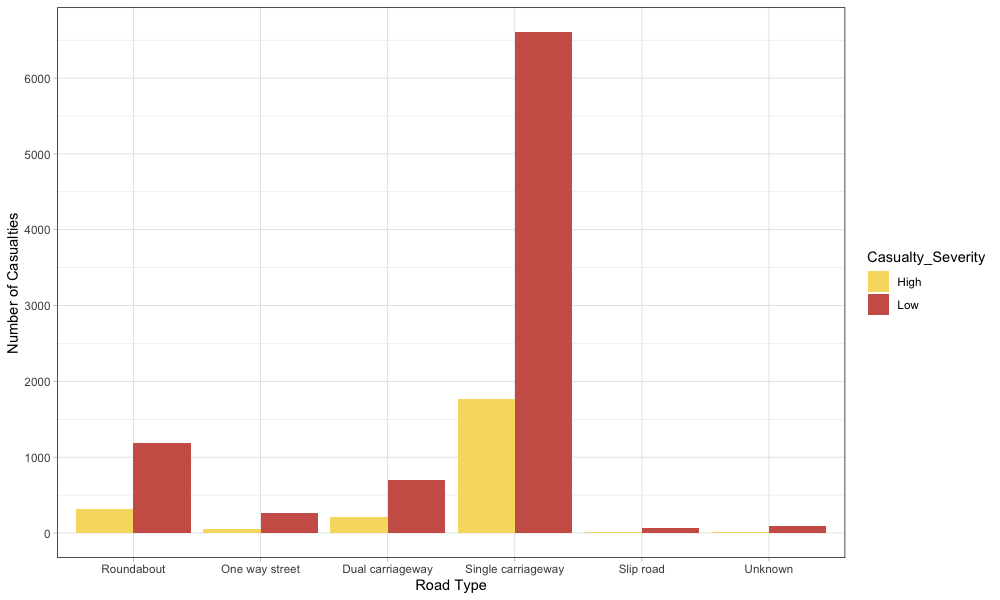
```

(Figure 5) indicates the occurrence of accidents on the basis of a road type. It is quite clear from the data shown that the majority of casualties occurred on single carriageway. The second row is roundabout roadtype. One way street seems to be far safe with very less occurrences of cyclist casualties.

```{r, include=TRUE, echo=FALSE, message=FALSE, warning=FALSE, fig.pos="h!", fig.align="center",out.width="75%",fig.cap="Casualty type counts by speed limit"}
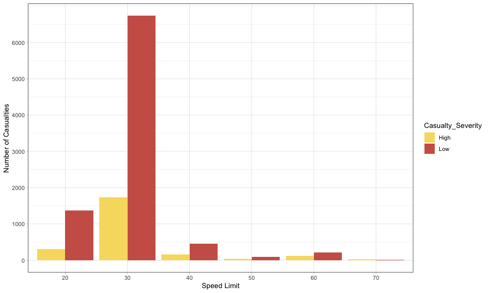
```

(Figure 6) indicates the number of casualties that occurred at each set of speed limit. It is clear from the figure shown that most of the incidents happened on roads where the speed limit was to be just 30 mph. It gives rise to concerns that incidents may have occurred on such roads due to over-speeding of vehicles at 30 mph is perceived to be a reasonable speed limit.

\newpage
```{r, include=TRUE, echo=FALSE, message=FALSE, warning=FALSE, fig.pos="h!", fig.align="center",out.width="75%",fig.cap="Casualty type counts by light conditions"}
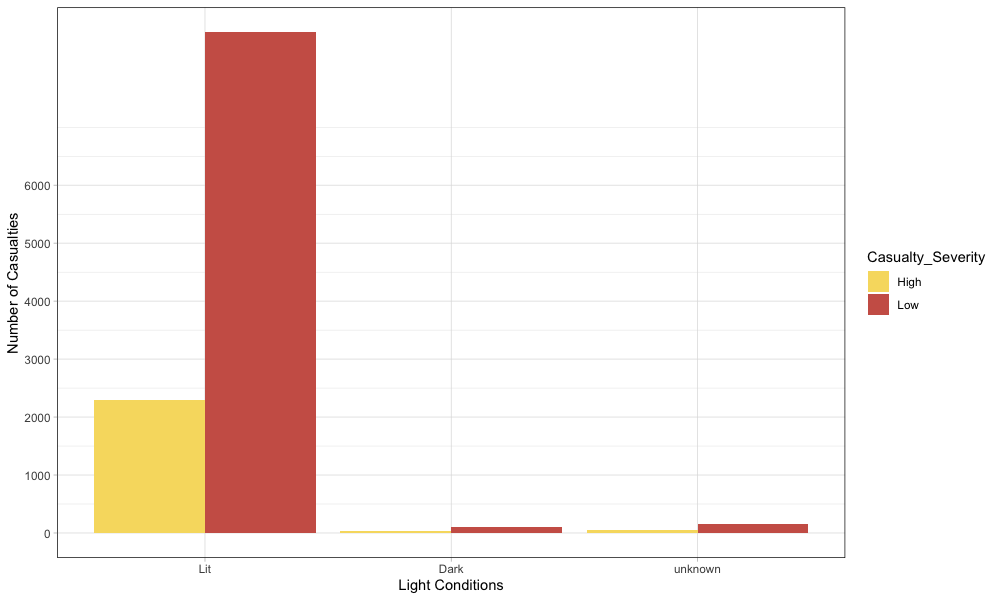
```

(Figure 7) indicates the frequency of injuries under various light conditions. Contrary to the assumption that casualties are more likely to occur under dark conditions, evidence indicates that most injuries have occurred under well-lit conditions.

```{r, include=TRUE, echo=FALSE, message=FALSE, warning=FALSE, fig.pos="h!", fig.align="center",out.width="75%",fig.cap="Casualty type counts by weather conditions"}
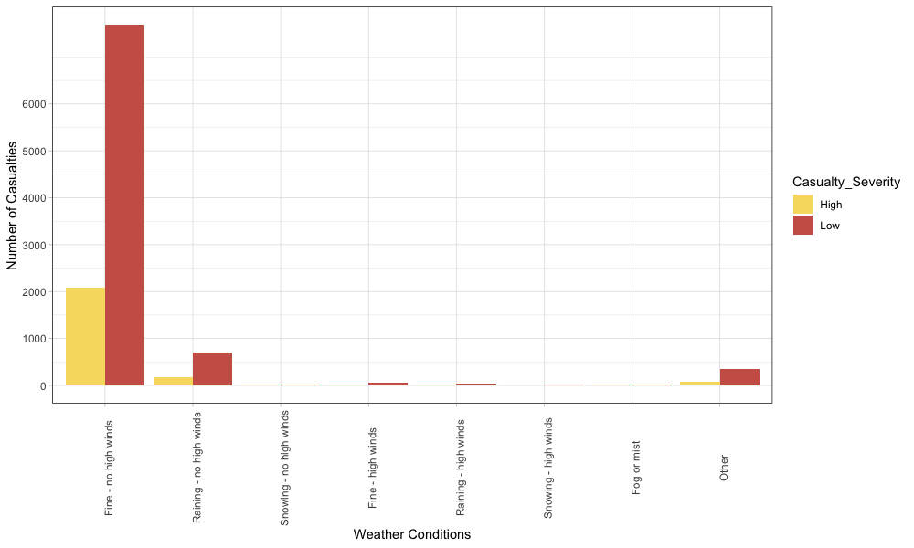
```

(Figure 8) indicates the distribution of injuries occurring in various environmental conditions. As most injuries have happened in good weather conditions with no strong winds, opposed to bad weather conditions such as high winds, rain, snow, etc.

```{r, include=TRUE, echo=FALSE, message=FALSE, warning=FALSE, fig.pos="h!", fig.align="center",out.width="75%",fig.cap="Casualty type counts by road surface conditions"}
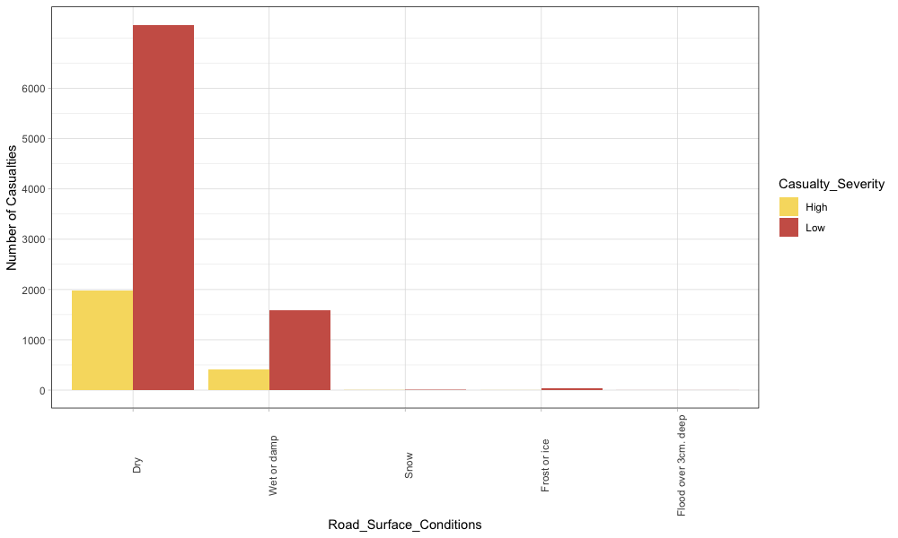
```

\newpage
(Figure 9) indicates the road surface conditions in which casualties have occurred. Although most of the casualties took place under dry road conditions, some casualties occurred under wet road conditions.

```{r, include=TRUE, echo=FALSE, message=FALSE, warning=FALSE, fig.pos="h!", fig.align="center",out.width="75%",fig.cap="Casualty type counts by time"}
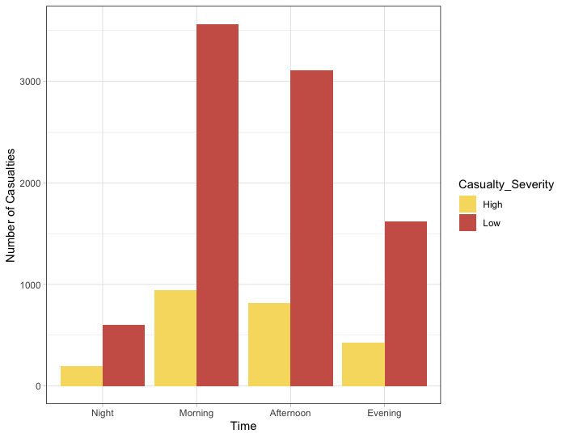
```

(Figure 10), displays the time variable distribution. Contrary to the belief that most of the casualties may have happened during night hours, data shows that most of the casualties occurred in daylight conditions during the morning/afternoon period.

\newpage
```{r, include=TRUE, echo=FALSE, message=FALSE, warning=FALSE, fig.pos="h!", fig.align="center",out.width="75%",fig.cap="Casualty type counts by gender"}
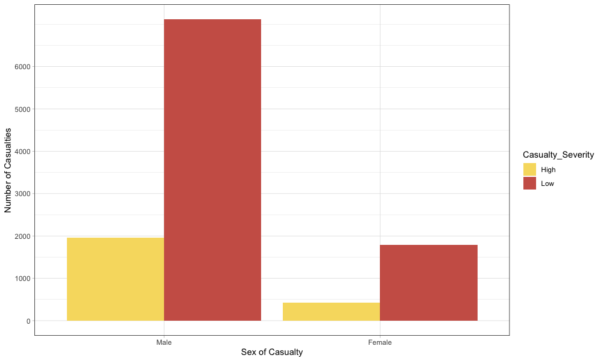
```

(Figure 11), displays the casualties based on gender. As shown in the figure 80% of male cyclist are prone to casualties compare to female cyclist.


```{r, include=TRUE, echo=FALSE, message=FALSE, warning=FALSE, fig.pos="h!", fig.align="center",out.width="75%",fig.cap="Casualty type counts by month"}
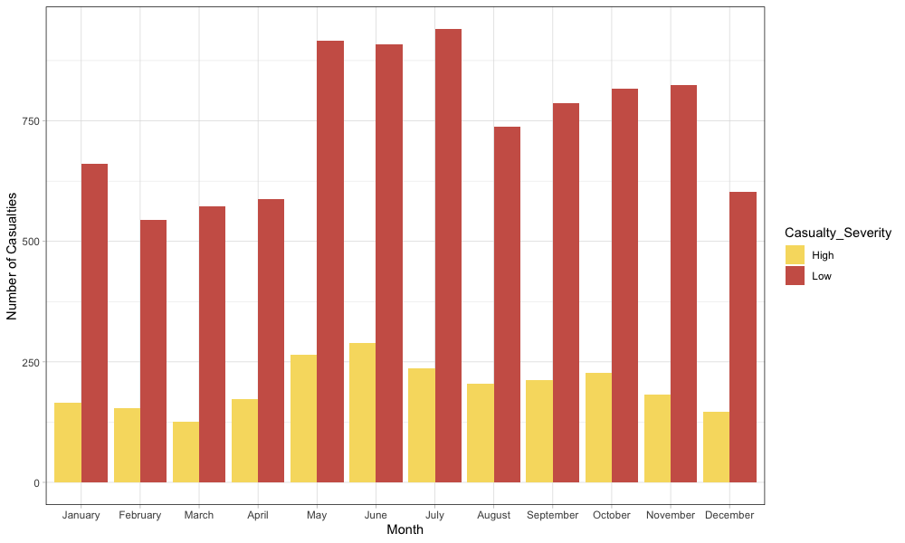
```

(Figure 12), shows the monthly casualties. As shown in the figure, the number of casualties occurs every month but more casualties can be seen in May, June and July compared to other months.

\newpage
```{r, include=TRUE, echo=FALSE, message=FALSE, warning=FALSE, fig.pos="h!", fig.align="center",out.width="75%",fig.cap="Casualty type counts by urban or rural area"}
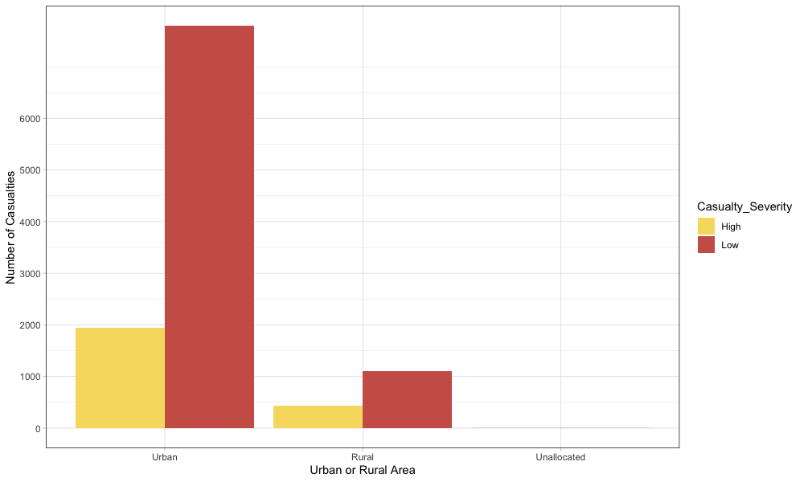
```

(Figure 13), shows the number of casualties in the urban or rural areas. The number of casualties, as shown in the figure, is more in urban areas compared to rural areas.

```{r, include=TRUE, echo=FALSE, message=FALSE, warning=FALSE, fig.pos="h!", fig.align="center",out.width="75%",fig.cap="Casualty type counts by journey purpose of cyclist"}
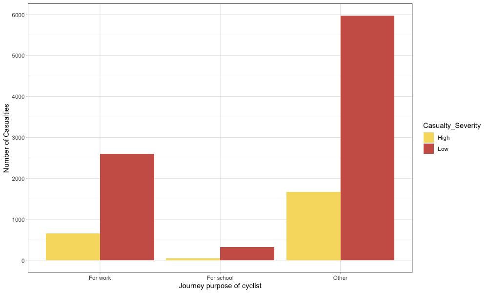
```

(Figure 14), shows casualties based on cyclist's journey purpose. As shown in the figure, the number of casualties occurred while the cyclist was out for other work on the road and the least casualties occurred whilst the cyclist was off to school.


## Data Modeling

Data modeling is the most critical stage where a model is developed with the aid of a dataset to make predictions for a given future value. In order to carry out the predictions and modeling, four different classification algorithms, such as naive bayes, logistic regression, random forest, and decision tree are implemented to predict the casualty severity of cyclist in United Kingdom. In this project, the data is split in the ratio of 70:30, where the training dataset comprises of 70% of the whole dataset, while the testing dataset comprises of the remaining 30%. The balanced data was used for the training dataset and an imbalanced data was used for the testing dataset to check the accuracy and to see how the balanced dataset gives better result than the imbalanced data. Hence the rose algorithm for the imbalanced data was used for the training dataset.
Casualty Severity is considered as the dependent or the target variable and other variables are considered as the independent variables. 
To measure the performance of the algorithm the metrics used will be precision, accuracy and recall. The formulas of the performance metrics:

\newcommand\MyBox[2]{
  \fbox{\lower0.75cm
    \vbox to 1.7cm{\vfil
      \hbox to 1.7cm{\hfil\parbox{1.4cm}{#1\\#2}\hfil}
      \vfil}%
  }%
}
\noindent
\renewcommand\arraystretch{1.5}
\setlength\tabcolsep{0pt}
\begin{tabular}{c >{\bfseries}r @{\hspace{0.7em}}c @{\hspace{0.4em}}c @{\hspace{0.7em}}l}
  \multirow{10}{*}{\parbox{1.1cm}{\bfseries\raggedleft actual\\ value}} & 
    & \multicolumn{2}{c}{\bfseries Prediction outcome} & \\
  & & \bfseries p & \bfseries n & \bfseries total \\
  & p$'$ & \MyBox{True}{Positive} & \MyBox{False}{Negative} & P$'$ \\[2.4em]
  & n$'$ & \MyBox{False}{Positive} & \MyBox{True}{Negative} & N$'$ \\
  & total & P & N &
\end{tabular}

\bigskip

Accuracy = (TP + TN) / (TP + TN + FP + FN)						

Accuracy is the ratio of correctly predicted observation to that of the total number of observations.

Precision = TP / (TP + FP)			

Precision is ratio of correctly predicted positive observations to that of the total predicted positive observations.

Recall = TP / (TP + FN)								

Recall is the ratio of correctly predicted positive observations to all the observations present in actual class, it is also referred to as sensitivity.

Here, TP = True Positive, TN = True Negative, FP = False Positive, and FN = False Negative.

### Handling the Imbalanced dataset
Distribution of the target variable, the data is still imbalanced. This affects the performance of the model by overfitting to the biased variable. Hence, it needs to be balanced. In order to tackle this situation, two techniques are practiced. The first technique involves in the combination of both oversampling and under-sampling the affected variable, while the second technique involves in ROSE (Random Over-Sampling Examples Examples Examples). In the case of first technique about the combination of under-sampling and oversampling, most of the class is under-sampled, while some class is oversampled. Whereas, in ROSE (Random Over-Sampling Examples Examples) technique, data is generated using the bootstrap approach and sampling(@rose). On comparison, the ROSE technique generates the data synthetically with higher accuracy than that of the combination of under-sampling and oversampling method. Hence, ROSE method is implemented for balancing the data. Results of ROSE algorithm are discussed in section 4.1. 

## Supervised learning algorithms

To predict data classification algorithm is used, by constructing a model using the data analysis approach (@atnafu). The specific classification algorithms are used depending on the target variable. (@shanthi), in order to get exciting patterns huge amount of data needs to be sorted which is done by using classification algorithm. The process consists of two phases, modeling and prediction of future data. The model building phase uses classification algorithm, while the prediction stage uses future data to provide interesting patterns. The predefined class set is used to classify future data in the classification process (@7975380). Different types of algorithms that are used in this project are mentioned below.

### Naive Bayes 
Naive Bayes is an important classification algorithm commonly used in the dataset of road accidents (@atnafu). The Bayesian theorem is used to estimate class probabilities. The Bayesian network for casualty severity modeling on the basis of a graphical model that describes the variables and their dependencies (@zong). Easy to implement, computing and supporting numeric and textual data are some of the features of naive bayes. Naive Bayes operates on the principle of probability by identifying the class. It's an easy approach to classifying various groups. It performs in two steps, the first step is functional regarding the train dataset and the second step is the classification of the model. To perform the naive bayes modeling 'e1071' package is used from RStudio (@e1071). On the basis of conditional probability theorem, the model categorizes the object in various classes. Here the dependent variable casualty severity  will be used to carry out the classification. The results of naive bayes model have been discussed in 4.2.

### Logistic Regression
Logistic Regression is a popularly used statistical model that is mainly used for supervised classification techniques. It was devised by David Cox in 1958 (@zekic). It consists of three types such as binary (for binary outcomes), multinomial (for multiple classes), and ordinal (for categories that are ordered). The model functions by predicting the dependent variable/target variable that's a binary variable with two outcomes based on several independent variables that can either be numeric or categorical with classes. It functions with the help of logit function, where it possesses beta intercept and each variable's respective beta coefficients. Logistic regression is a popularly used statistical model that is mainly used for supervised classification techniques. The model functions by predicting the dependent variable/target variable that's a binary variable with two outcomes based on several independent variables that can either be numeric or categorical with classes. It functions with the help of logit function, where it possesses beta intercept and each variable's respective beta coefficients. This GLM model of binomial family is implemented to compose a model that predicts the target variable 'casualty severity' if it's high or low based on the influence of the independent variables of the data. The results of logistic regression model have been discussed in 4.3.

### Decision Tree
Decision Tree is the most widely used and well-known algorithm for the classification method (@Informatica). Many of the features of the decision tree algorithm are simple to understand, generate rules and the the complexity of the problem. According to (@ali), if the decision tree is used for a nominal target variable, it is called a classification tree and if the tree is used for a continuous variable, it is called a regression tree. Decision tree uses top-down recursive approach to perform the classification which begins at the root node (@7975380). The decision tree is widely used method for classifying data mining technique. The root node consists of a situation in which the tree is further divided into many branches. It incorporates two key concepts for the design of the tree. They are information gain and entropy. Entropy is used to test the uniformity of the data. It defines the degree of randomness that depends on two values of one and zero. Information gain is dependent on the reduction of entropy, if the variable in the dataset consists of a high information gain, it will have the best chance of splitting the variable. With the help of 'rpart' library (@rpart), the decision tree model is built in RStudio. Implementation of decision tree is based on the casualty severity which is the target variable. Severity efficiency is determined by the leaf nodes of the tree on the basis of different conditions. The results of decision tree model have been discussed in 4.4.

### Random Forest
Random Forest are used for both classification and regression models. The Random Forest is an improvement over the decision tree layout. This model consists of a tree forest where the input is assigned to each tree in the forest and the output generated from the tree forest determines the accuracy of the algorithm. Significant variables in the data set can be identified using a random forest algorithm. As per (@7492647), increasing the variable results in a stronger forest and decreasing the variable results in a poor forest for classification. According to (@7965753) random forest efficiency is more than decision tree, naive bayes. Random Forest consists of a number of random trees mixed up to produce accurate results. Random forest builds a tree by using multiple decision trees and uses a bagging approach to improve the tree's accuracy. The error rate of random forest depends on two cases, first is the relationship between the trees and second is the strength of the trees. The casualty severity is used as the target variable in the random forest to perform the classification of the variable. With the help of 'randomForest' library (@random), the random forest model is built in RStudio. The results of random forest model have been discussed in 4.5. Important variables were then calculated using the random forest algorithm. The significance is calculated on the basis of the mean decrease in the gini coefficient. Gini coefficient is a measure of how each attribute contributes to the homogeneity of the nodes and results in the resulting random forest. Attributes that are significant possesses a higher mean decrease in Gini coefficient. Refer section 4.5.1. for results. A revised model was thus performed after removing the insignificant variable and there was not much difference in the result (Refer Section 4.5.2.).

\newpage
# Results{}                                                                                                                 
## ROSE algorithm for balancing Imbalanced dataset

As the distribution of the target variable, the data is still imbalanced. This affects the performance of the model by overfitting to the biased variable. Hence, it needs to be balanced for the training dataset.

\begin{table}[!htb]
    \caption{Target Variable Casualty Severity}
    \begin{minipage}{.5\linewidth}
      \caption{Imbalanced target variable}
      \centering
        \begin{tabular}{l@{\hskip 0.5in}l@{\hskip 0.5in}}
           High & Low \\
              2380  & 8896\\
        \end{tabular}
    \end{minipage}
    \begin{minipage}{.5\linewidth}
      \centering
        \caption{Balanced target variable}
        \begin{tabular}{l@{\hskip 0.5in}l@{\hskip 0.5in}}
            Low  &  High \\
            5726 &  5550 \\
        \end{tabular}
    \end{minipage} 
\end{table}

Table 5 demonstrates the value of the target variable which consist of two sets, first (Table 6) shows how the target variable is imbalanced and second (Table 7) demonstrates a balanced data for the training dataset.

```{r, include=TRUE, echo=FALSE, message=FALSE, warning=FALSE, fig.pos="h!", fig.align="center",out.width="75%",fig.cap="Comparison of the distribution of target variable after the implementation of ROSE technique"}
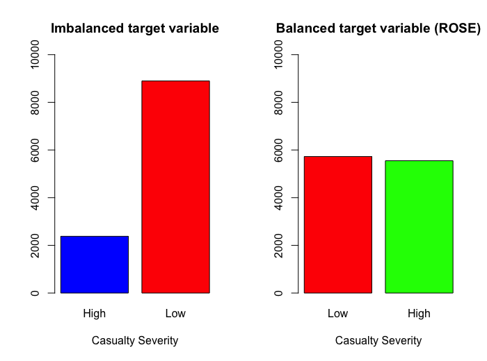
```
(Figure 15) demonstrates the balancing of the target variable, 'Casualty Severity' using the ROSE (Random Over-Sampling Examples)) technique. Thus, the data is balanced for the training dataset.


## Implementing Naive Bayes
The confusion Matrix shown in table 8 was built using naive bayes model using package 'caret' from R library (@caret) for (table 9) the training dataset and (table 10) testing dataset respectively. From the table 11, it can be seen that the model with testing dataset has higher accuracy more than the training dataset.

\begin{table}[!htb]
    \caption{Confusion matrix of naive bayes model}
    \begin{minipage}{.5\linewidth}
      \caption{Training Set}
      \centering
        \begin{tabular}{lll}
        & Reference & \\
         Prediction  & Low & High\\
           Low & 2673 & 1982 \\
          High & 1330 & 1908  \\
        \end{tabular}
    \end{minipage}%
    \begin{minipage}{.5\linewidth}
      \centering
        \caption{Testing Set}
        \begin{tabular}{lll}
          & Reference & \\
          Prediction  & High & Low \\
           High & 49 & 54 \\
            Low & 670 & 2610\\
        \end{tabular}
    \end{minipage} 
\end{table}

\begin{table}[ht]
\caption{Summary of naive bayes model} 
\centering
\begin{tabular}{c@{\hskip 0.5in}c@{\hskip 0.5in}c@{\hskip 0.5in}c@{\hskip 0.5in}}
\hline\hline
Model & Accuracy & Precision & Recall \\ [0.5ex]
\hline
Train & 58.04\% & 57.42\% & 66.77\% \\ 
Test & 78.65\% & 47.57\% & 68.15\% \\[1ex]
\hline
\end{tabular}
\end{table}

\newpage
## Implementing Logistic Regression
The confusion Matrix shown in table 12 was built using logistic regression model using package 'mass' from R library (@mass) for (table 13) the training dataset and (table 14) testing dataset respectively. From the table 15, it can be seen that the model with training dataset has higher accuracy more than the testing dataset.

\begin{table}[!htb]
    \caption{Confusion matrix of logistic regression model}
    \begin{minipage}{.5\linewidth}
      \caption{Training Set}
      \centering
        \begin{tabular}{lll}
        & Reference & \\
         Prediction  & Low & High\\
           Low & 2571 & 1432 \\
          High & 1791 & 2099  \\
        \end{tabular}
    \end{minipage}%
    \begin{minipage}{.5\linewidth}
      \centering
        \caption{Testing Set}
        \begin{tabular}{lll}
          & Reference & \\
          Prediction  & High & Low \\
           High & 16 & 703 \\
            Low & 7 & 2657\\
        \end{tabular}
    \end{minipage} 
\end{table}

\begin{table}[!htb]
\caption{Summary of logistic regression model} 
\centering
\begin{tabular}{c@{\hskip 0.5in}c@{\hskip 0.5in}c@{\hskip 0.5in}c@{\hskip 0.5in}}
\hline\hline
Model & Accuracy & Precision & Recall \\ [0.5ex]
\hline
Train & 59.16\% & 59.44\% & 53.95\% \\ 
Test & 20.98\% & 20.92\% & 97.77\% \\[1ex]
\hline
\end{tabular}
\end{table}


## Implementing Decision Tree
The confusion Matrix shown in table 16 was built using decision tree model using package 'rpart' from R library (@rpart) for (table 17) the training dataset and (table 18) testing dataset respectively. From the table 19, it can be seen that the model with testing dataset has higher accuracy more than the training dataset but the with no precision and a recall with a value 0.

\begin{table}[!htb]
    \caption{Confusion matrix of decision tree model}
    \begin{minipage}{.5\linewidth}
      \caption{Training Set}
      \centering
        \begin{tabular}{lll}
        & Reference & \\
         Prediction  & Low & High\\
           Low & 2204 & 1576 \\
          High & 1799 & 2314  \\
        \end{tabular}
    \end{minipage}%
    \begin{minipage}{.5\linewidth}
      \centering
        \caption{Testing Set}
        \begin{tabular}{lll}
          & Reference & \\
          Prediction  & High & Low \\
           High & 0 & 0 \\
            Low & 719 & 2664\\
        \end{tabular}
    \end{minipage} 
\end{table}

\begin{table}[ht]
\caption{Summary of decision tree model} 
\centering
\begin{tabular}{c@{\hskip 0.5in}c@{\hskip 0.5in}c@{\hskip 0.5in}c@{\hskip 0.5in}}
\hline\hline
Model & Accuracy & Precision & Recall \\ [0.5ex]
\hline
Train & 57.24\% & 58.31\% & 55.06\% \\ 
Test & 78.75\% & NAN\% & 0\% \\[1ex]
\hline
\end{tabular}
\end{table}

\newpage
## Implementing Random Forest

The confusion Matrix shown in table 20 was built using random forest model using package 'randomForest' from R library (@random) for (table 21) the training dataset and (table 22) testing dataset respectively. From the table 23, it can be seen that the model with training dataset has higher accuracy more than the testing dataset.

\begin{table}[!htb]
    \caption{Confusion matrix of random forest model}
    \begin{minipage}{.5\linewidth}
      \caption{Training Set}
      \centering
        \begin{tabular}{lll}
        & Reference & \\
         Prediction  & Low & High\\
           Low & 3953 & 103 \\
          High & 50 & 3787 \\
        \end{tabular}
    \end{minipage}%
    \begin{minipage}{.5\linewidth}
      \centering
        \caption{Testing Set}
        \begin{tabular}{lll}
          & Reference & \\
          Prediction  & High & Low \\
           High & 530 & 0 \\
            Low & 189 & 2664\\
        \end{tabular}
    \end{minipage} 
\end{table}

\begin{table}[!htb]
\caption{Summary of random forest model} 
\centering
\begin{tabular}{c@{\hskip 0.5in}c@{\hskip 0.5in}c@{\hskip 0.5in}c@{\hskip 0.5in}}
\hline\hline
Model & Accuracy & Precision & Recall \\ [0.5ex]
\hline
Train & 98.02\% & 97.46\% & 98.68\% \\ 
Test & 94.41\% & 1\% & 73.71\% \\[1ex]
\hline
\end{tabular}
\end{table}

\newpage
```{r, include=TRUE, echo=FALSE, message=FALSE, warning=FALSE, fig.pos="h!", fig.align="center",out.width="55%",fig.cap="Comparison of error versus the number of trees."}
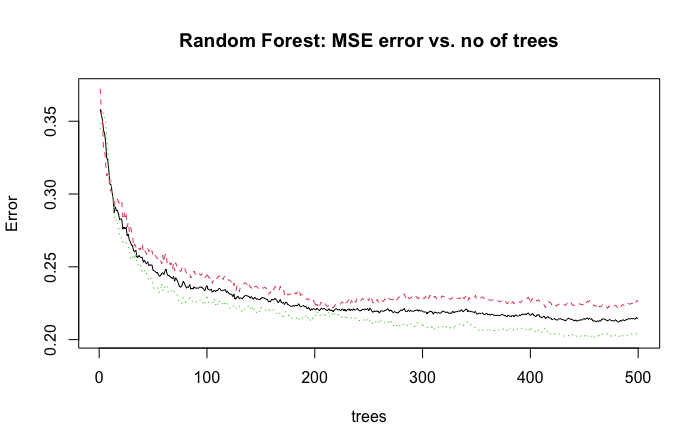
```

Figure 16 shows how the error decreases with the increase in the number of trees, after 300, the error rate is not much increasing which tends to almost constant. As a result, the model was designed with 500 trees, although the data set is wide and requires longer computation time for better predictive performance.

### Identifying the important variables from random forest model:    
The importance of each variable in the built-in model is calculated using a random forest algorithm. The significance is calculated on the basis of the mean decrease in the Gini coefficient. Gini coefficient is a measure of how each attribute contributes to the homogeneity of the nodes and results in the resulting random forest. Attributes that are significant possesses a higher mean decrease in Gini coefficient. Table 24 indicates the importance of each independent variable in the random forest model.

\begin{table}[h]
\caption{Importance of each variables based on mean decrease in Gini.}
\bigskip
\centering
\begin{tabular}{l c}
\hline\hline
 & MeanDecreaseGini\\ [0.75ex]
\hline
Date                            &  516.29260\\
Day\_of\_Week                      & 353.78081\\
Time                              &212.39392\\
Road\_Type                       &  156.33193\\
Speed\_limit         &              166.68112\\
Junction\_Detail      &             282.16488\\
Junction\_Control      &             97.79726\\
Light\_Conditions       &            37.61521\\
Weather\_Conditions      &          114.76511\\
Road\_Surface\_Conditions  &          76.16405\\
Special\_Conditions\_at\_Site  &       21.24384\\
Urban\_or\_Rural\_Area          &      55.26323\\
Sex\_of\_Casualty               &     89.72172\\
Age\_of\_Casualty  &              681.05445\\
Journey\_Purpose\_of\_Driver     &     114.73173\\ [1ex]
\hline
\end{tabular}
\end{table}

As per Figure 17, it is noted that, apart from the last 6 variables,  'Junction Control', 'Sex of Casualty', 'Road surface conditions', 'Urban or Rural Area', 'Light conditions' and 'Special Conditions at Site' all the other variables have a mean decrease score of above 100. Such variables are then defined as important for the model and are used as the only input variable for another model. This model is free from the contribution of the other 6 irrelevant variables.

```{r, include=TRUE, echo=FALSE, message=FALSE, warning=FALSE, fig.pos="h!", fig.align="center",out.width="75%",fig.cap="Significance of the variables plotted based on mean decrease in Gini"}
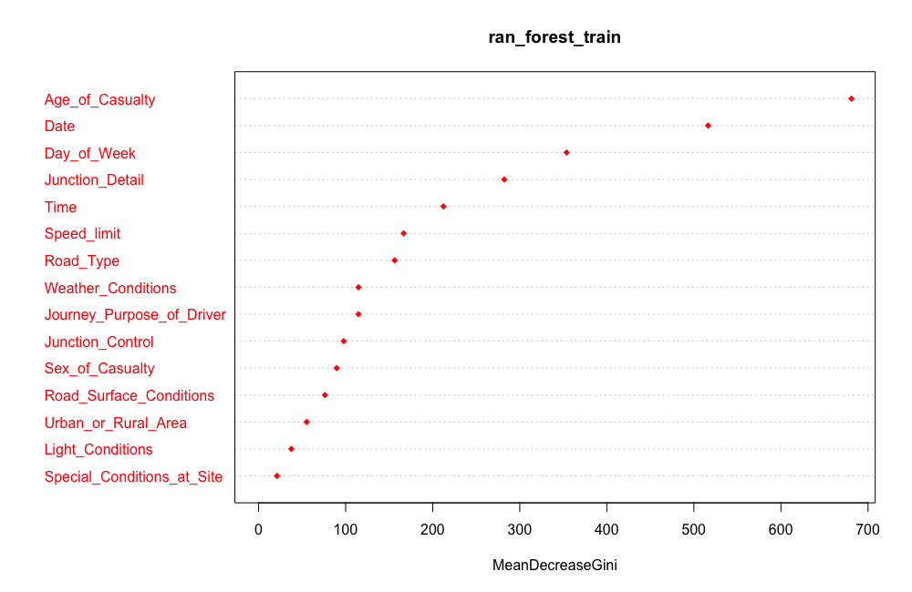
```

### Implementing all models with only the identified important variables as input. 


Important variables found are fed as input variables to all of the algorithms listed above to see if they boost the accuracy of the existing models. Nonetheless, based on the analysis, there was no difference between them and the current ones.

\begin{table}[h]
\caption{ Accuracy of the revised models}
\centering
\begin{tabular}{l@{\hskip 0.5in}c@{\hskip 0.5in}c@{\hskip 0.5in}c@{\hskip 0.5in}} \hline\hline
 Models & Dataset & Accuracy & \\ [0.5ex]
\hline 
& Train & 58.38\% & (0.34\% increase)\\[-1ex]
\raisebox{1.5ex}{Naive Bayes} & Test & 78.89\% & (0.24\% increase)\\[1ex]
& Train & 58.75\% & (0.41\% decrease)\\[-1ex] \raisebox{1.5ex}{Logistic Regression} &  Test & 21.07\%&(0.09\% decrease)\\[1ex]
& Train & 99.08\% & (1.06\% increase)\\[-1ex] \raisebox{1.5ex}{Random Forest} & Test & 98.91\% & (4.5\% increase)\\[1ex]
& Train & 57.24\% &(same as above)\\[-1ex] \raisebox{1.5ex}{Decision Tree} & Test & 78.75\% & (same as above)\\[1ex]
\hline 
\end{tabular}
\end{table}

On the basis of the above findings, objective D is clear that negligible variables did not really affect the output of the current models, because they did not affect the accuracy of the revised models thus did not contribute much to the estimation of the dependent variable.


### Evaluation based on the accuracy of each model

During this step, models developed at the data modeling stage for the testing data are evaluated and compared to each other to determine the best prediction model for this analysis.

```{r, include=TRUE, echo=FALSE, message=FALSE, warning=FALSE, fig.pos="h!", fig.align="center",out.width="75%",fig.cap="Fourfold plot - comparison of all the models based on accuracy"}
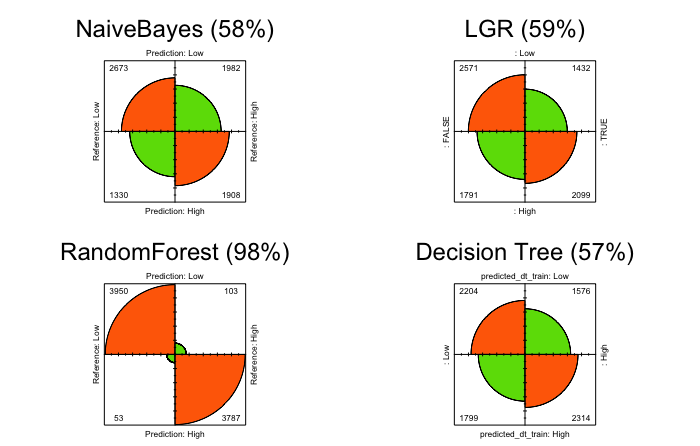
```

Figure 18 displays the four-fold plot of all models, built on the basis of their respective confusion matrices using the balanced train dataset. Based on their accuracy, the Random Forest model ranks at the top with the highest accuracy of 98%, followed by the logistic regression model with an accuracy of 59% , Naive Bayes with an accuracy of 58%. Model with the least accuracy of all is the Decision Tree model with an accuracy of 57%. 

### Evaluation based on the ROC curve of each model
The ROC (Receiver Operating Characteristic) curve is a graphical plot formed by plotting TP (True Positive) versus FP (False Positive). Effective ROC curves should have a high AUC (Area Under Curve) value. The higher the AUC value, the better the model is. pROC library in R (@proc) was used to compute the ROC curves. Figure 19 displays the ROC curves of the models together with their AUC values. It is evident that the Random Forest's ROC curve looks the best of all with highest AUC value of 0.998 than other models.

```{r, include=TRUE, echo=FALSE, message=FALSE, warning=FALSE, fig.pos="h!", fig.align="center",out.width="75%",fig.cap="Comparison of  AUC values of all the models and ROC curves"}
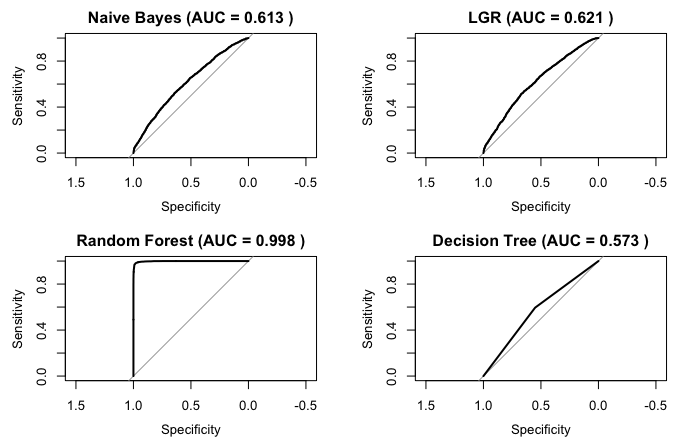
```

\newpage
### Summary
Comparison of all four models using the balanced training set focused on measures such as precision, accuracy, recall and AUC values. The training dataset which consists of the balanced dataset performed well than the testing dataset which was unbalanced. Thus objective C is being clear of how to handle the imbalanced dataset. It is clear in both training and test dataset that the Random Forest model excels in all the metrics that make it the best model compared to all the other four models, because it has achieved the highest metrics in all the categories, whereas the Decision Tree has achieved the lowest values in all the metrics. Thus objective B is being clear that random forest performed well and is the most efficient algorithm. It means that the precision of the model increases with the rise in the number of trees. With the target variable levels, 'Casualty Severity' being extremely imbalanced, the models have performed fairly well. Table 26 displays the summary of the training dataset and Table 27 displays the summary of the test dataset.

\begin{table}[!htb]
\caption{Summary of the training dataset table} 
\centering
\begin{tabular}{c@{\hskip 0.25in}c@{\hskip 0.25in}c@{\hskip 0.25in}c@{\hskip 0.25in}c@{\hskip 0.25in}}
\hline\hline
Model     & Accuracy(\%)    & Precision(\%)     & Recall(\%)    & AUC(\%) \\ [0.5ex]
\hline
Naive Bayes  &  58.04 & 57.42   & 66.77   & 0.613 \\
Logistic Regression    & 59.16    & 59.44     & 53.95 & 0.621 \\
Random Forest     & 98.02    & 97.46     & 98.69  & 0.998\\
Decision Tree & 57.24    & 58.31     & 55.06     & 0.573 \\ [1ex]
\hline
\end{tabular}
\end{table}

\begin{table}[!htb]
\caption{Summary of the testing dataset table} 
\centering
\begin{tabular}{c@{\hskip 0.25in}c@{\hskip 0.25in}c@{\hskip 0.25in}c@{\hskip 0.25in}c@{\hskip 0.25in}}
\hline\hline
Model     & Accuracy(\%)    & Precision(\%)     & Recall(\%)    & AUC(\%) \\ [0.5ex]
\hline
Naive Bayes  &  78.65 & 47.57   & 68.15   & 0.609 \\
Logistic Regression    & 20.98    & 20.92     & 97.77 & 0.616  \\
Random Forest     & 94.41   & 1     & 73.71  & 1\\
Decision Tree & 78.75    & NAN    & 0     &  0.5\\ [1ex]
\hline
\end{tabular}
\end{table}

\newpage
# Conclusion and Future Work
The aim and purpose of this research project was to predict the severity of cyclist accidents in the United Kingdom. Several data mining methods have been used and tested to tackle the question of assessing the extent of the accident in the United Kingdom. The machine learning algorithms used for this study produced good results and addressed the research question. Starting with data preparation, missing values were handled and multiple classes that were ambiguous in each factor variable were handled to have meaningful classes for better data analysis using binning technique. The Random Over-Sampling Examples Examples (ROSE) technique was then applied to manage the imbalanced dataset as it could lead to bias predictions and incorrect results. It has improved the efficiency of the models and produced efficient accuracy results. Due to the difference in the target variable between the three classes, two classes were combined into one for better data balancing. With the purpose of successful data analysis, the behaviors and trends of each variable have been analyzed in the data exploration. It offered valuable insights into the occurrence of accidents. It was found that most of the casualties happened during the daytime or well-lit conditions on dry/wet roads when the weather was absolutely good with no strong winds. The cyclist accidents which happened at the speed limit of 30 are the area where special measure is to be taken as 30 speed limit is considered as the safe, the speed limit can either be reduced to 20 or the lane for cyclist should be widen to reduce the casualties. Several classification models have been developed to allow an accurate prediction of the target variable. It was observed that the Random Forest technique worked the best of all the other models with a precision of 98%. The work carried out in this project, the applicant wants to carry out future research by doing some time series analysis and using data from previous year to see the month and time of accident in some areas which can help to see how many cyclist casualties are affected in several years.

\newpage
\appendix
\section{Appendix}

This section contains plots for the unbalanced testing datasets.

--Significance of the variables plot for unbalanced test dataset.
```{r, include=TRUE, echo=FALSE, message=FALSE, warning=FALSE, fig.pos="h!", fig.align="center",out.width="60%",fig.cap="Significance of the variables plotted based on mean decrease in Gini"}
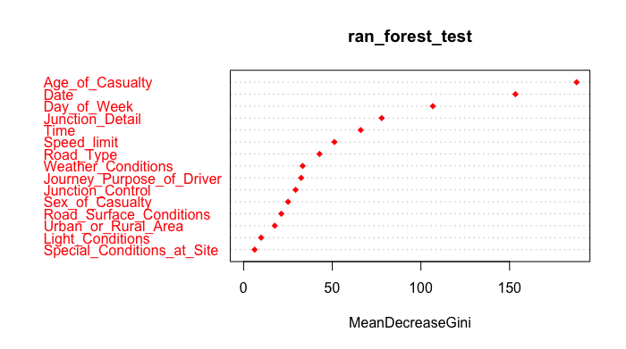
```

--Fourfold plot for unbalanced test dataset.
```{r, include=TRUE, echo=FALSE, message=FALSE, warning=FALSE, fig.pos="h!", fig.align="center",out.width="60%",fig.cap="Fourfold plot - comparison of all the models based on accuracy"}
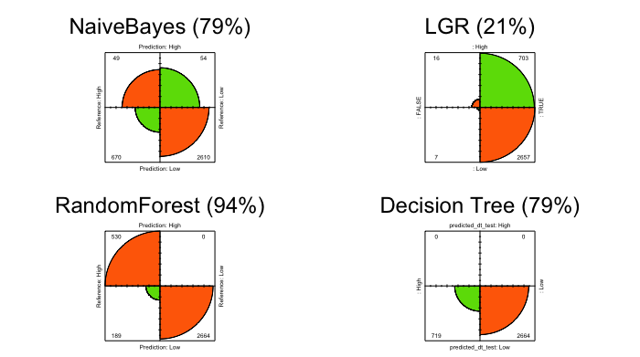
```

--Comparison of  AUC values for unbalanced test dataset.
```{r, include=TRUE, echo=FALSE, message=FALSE, warning=FALSE, fig.pos="h!", fig.align="center",out.width="60%",fig.cap="Comparison of  AUC values of all the models and ROC curves"}
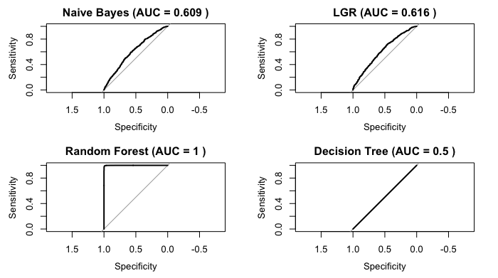
```


\newpage
\newpage
# Bibliography